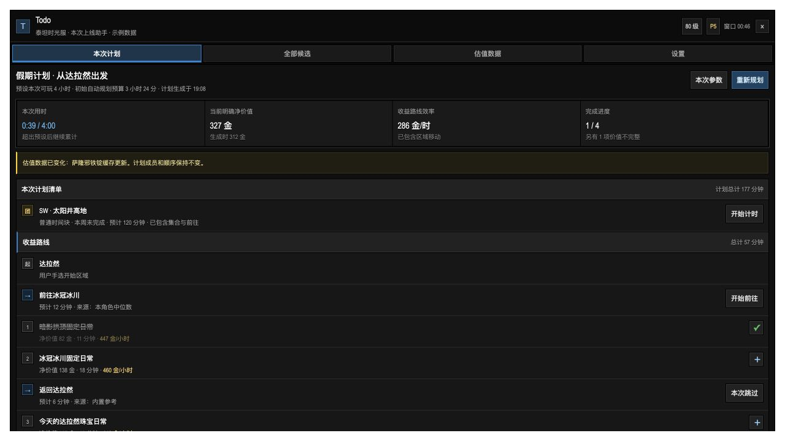
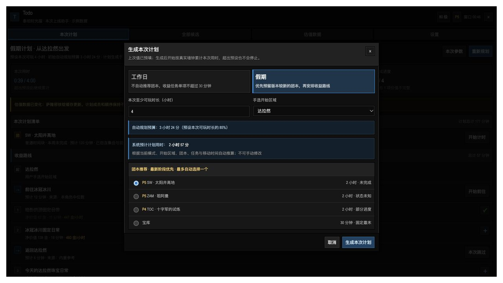

# Todo

**简体中文** | [English](README.en.md)

[**⬇ 直接下载 Todo 1.0.0-beta.1 安装包（ZIP）**](https://github.com/fishman-r/wow-addon-todo/raw/refs/heads/main/releases/Todo-1.0.0-beta.1.zip)

> 下载后解压，将其中的 `Todo` 文件夹放入 `_classic_titan_/Interface/AddOns/`。当前版本仍需在泰坦时光服 38002 客户端中完成真机验证。

Todo 是面向“泰坦重铸·时光服”80 级角色的个人上线规划插件。本仓库当前版本为 `1.0.0-beta.1`，目标客户端为 `Interface: 38002`。

产品、交互、数据口径与完整验收基线见 [Todo v1 产品与功能设计](docs/Todo-v1-product-design.md)。`beta.1` 已经实现第一条可安装、可生成、可执行、可保存的研发闭环；尚未完成时光服真机事实核验的能力会在 UI 和 `/todo doctor` 中明确显示为“未观察”“未验证”或“不可用”，不能据此宣称已经兼容 38002。

## 游戏界面效果预览

> 以下图片由当前 ElvUI 风格交互稿和示例数据生成，属于开发预览，并非泰坦时光服 38002 真机截图。实际游戏内效果以真机验证为准。

### 本次计划



### 本次参数



## beta.1 已实现

- 只有等级正好为 80 的角色可以生成计划、计时或采集估值数据；其他等级只显示拦截说明。
- 真正登录时要求确认工作日/假期、至少可玩时长和手选开始区域；`/reload` 可识别时继续当前会话。
- 固定使用真实剩余时间的 85% 自动规划；推荐数量没有固定上限。
- 工作日不自动推荐团本，也不自动加入单项超过 30 分钟的收益任务。
- 假期团本按 P5 → P4 → P3 → P2 → P1 → 宝库排序；25 人团本默认 120 分钟，21 人宝库默认 30 分钟。
- 计划生成后冻结成员、路线和顺序；完成、跳过、价格变化不会自动重排，只有“重新规划”会改变计划。
- 主界面显示 `实际累计计时 / 预设本次可玩时长`；累计计时允许超过预设时长。修改参数和“再玩 30 分钟”都不会重置累计用时。
- 任务、区域移动和团本预计耗时全部只读；学习值使用当前角色最近 20 个有效样本的中位数。
- 多任务计时按并行集合动态平均分摊；跨区移动暂停任务分摊，避免重复计时。
- 固定四页：本次计划、全部候选、估值数据、设置。
- 全部候选支持任务名、区域、专业、活动类型和 questID 的大小写不敏感包含检索；多关键词按 AND 匹配。
- 候选详情可修正解锁、今日完成、所属区域、固定成本和专业池今日具体 questID；预计耗时没有编辑入口。
- 估值来源优先级为：Todo 原生缓存 → 当前外部提供方 → 手动税前价 → 商店售价。
- 拍卖缓存没有自动有效期；空结果和失败不会清空旧记录。
- Todo 不发送任何拍卖查询。旧式拍卖结果事件只被动读取玩家已经触发的当前结果。
- 只有点击“导入所需物品价格”才调用 Auctionator 公开只读 API；只读取 Todo 当前需要的 itemID。
- 奖励袋无样本时价值为 0；数据模型支持按袋数保存原始内容分布并按当前市场重估。
- ElvUI 风格的独立深色 UI，不依赖 ElvUI 代码、配置或加载顺序。
- 非常驻窗口在最后一次有效输入/操作 60 秒后收起；鼠标悬停不暂停、不重置倒计时。
- 小地图入口：左键开关窗口，右键打开设置。
- schema v1 数据库、旧原型数据保留、分项二次确认清理和 `/todo doctor`。

## 当前保守降级

这些是进入 38002 真机测试前刻意保留的边界，不会用猜测数据填满：

- P5 固定日常目录当前优先完成 questID、区域和专业身份框架；泰坦服固定金币、奖励物品、材料成本、前置和中文标题仍需逐项核实。客户端能明确读取的任务标题和直接金币会覆盖占位信息。
- 未提供未经核实的跨区域内置路程。缺少路线样本时，该跨区组合不会自动加入；可以在“设置 → 路线耗时学习”中通过开始/到达操作形成样本，不能手填分钟。
- `C_AuctionHouse` 的泰坦服逐挂单语义尚未核实，因此现代结果事件只记录诊断状态，不会把聚合最低价伪装成“最低 20 条挂单中位数”。
- Auctionator 的调用签名已经按公开 v1 API 实现，但适配器仍显示“38002 待真机验证”；TSM 和 Auctioneer 只是未验证兼容槽。
- P1–P5 和宝库的实际 instanceID/encounterID 尚未建立真机映射；beta 使用名称别名观察结果并明确标记未验证。
- 自动奖励袋批次归因尚未开启。仅当后续真机能建立“同类袋子、无其他混杂来源”的可靠窗口时才会写样本。
- 奖励物品、多选奖励和任务成本目录未补齐前，明确净价值是保守下限；成本未知的任务不自动推荐。

因此首次使用时自动收益任务可能很少，甚至为空；插件会展示数据缺口，不会为了填满时间强塞任务。

## 安装

先执行：

```bash
./scripts/check.sh
./scripts/package.sh
```

发布包输出到：

```text
dist/Todo-1.0.0-beta.1.zip
```

解压后确保目录为：

```text
macOS:   /Applications/World of Warcraft/_classic_titan_/Interface/AddOns/Todo/Todo.toc
Windows: <魔兽目录>/_classic_titan_/Interface/AddOns/Todo/Todo.toc
```

进入游戏前，在角色选择界面启用 Todo。进入游戏后建议执行：

```text
/console scriptErrors 1
/dump select(4, GetBuildInfo())
```

第二条应返回 `38002`。

## 使用

1. 登录 80 级角色。
2. 选择工作日或假期模式。
3. 输入至少可玩时长。
4. 手选开始区域；选择“其他/不计算首段路程”时，只免除第一段移动。
5. 选择是否自动考虑团本，也可手动预留多个团本。
6. 查看只读预演后生成计划。
7. 按计划行开始任务、移动或团本计时；完成、部分结束或本次跳过。
8. 需要改变成员和路线时主动点击“重新规划”。

斜杠命令：

```text
/todo                  打开或关闭窗口
/todo help             显示帮助
/todo doctor           打开设置并打印兼容性诊断
/todo info             显示版本、构建和等级
/todo work 1.5         预填工作日和 1.5 小时；仍需确认
/todo holiday 4        预填假期和 4 小时；仍需确认
/todo replan           使用真实剩余时间重新规划
/todo extend 30        把 T 设置为当前 E + 30 分钟并重新规划
/todo stay             切换常驻显示
/todo ping             检查核心是否加载
```

删除数据不提供斜杠命令，必须在“设置”页首次点击后 5 秒内再次点击确认。

## 代码结构

```text
Todo/
├── Todo.toc             元数据与加载顺序
├── Compat38002.lua      所有游戏 API 的兼容与降级入口
├── Catalog.lua          P5 任务身份、区域、团本与常量
├── Store.lua            schema、作用域、周期、迁移和样本中位数
├── Valuation.lua        物品/任务/奖励袋估值与拍卖来源
├── Planner.lua          候选状态、检索、路线优化、稳定计划和会话
├── Tracking.lua         并行任务、移动、团本和异常样本计时
├── UI.lua               ElvUI 风格四页 UI、参数面板与交互
└── Todo.lua             事件、登录策略、斜杠命令和调度
```

离线测试覆盖：

- 组合价值优化和无固定数量上限；
- 工作日/假期团本规则；
- `T/E/R/B` 与超时继续计时；
- 多关键词检索；
- 估值来源优先级、最低 20 条中位数和空结果保留；
- Auctionator 显式、按需、零查询导入；
- 奖励袋首样本；
- 三任务并行平均分摊、集合变化和移动互斥；
- 四页 UI、登录参数确认、60 秒隐藏、修改 T 不重置 E 和非 80 级拦截。

## 38002 真机首轮检查

1. 开启脚本错误显示，80 级登录并完成一次生成流程。
2. `/reload` 后确认计划和累计墙钟时间继续；退出重登时确认不会静默恢复。
3. 用两个计划任务验证接取自动开始、并行分摊和交付结束。
4. 手动学习一条跨区路线，再重新规划确认来源变为“本角色实测中位数”。
5. 工作日确认没有自动团本和超过 30 分钟的自动任务。
6. 假期 2 小时只可能自动选择宝库；4 小时优先 P5 团本。
7. 手动搜索 Todo 所需物品，确认插件没有发查询，记录结果是否真的是逐挂单数据。
8. 安装目标版本 Auctionator 后执行一次显式导入，记录版本、价格口径、市场范围和失败情况。
9. 请求团本锁定，记录所有实际 instanceID、encounterID 和名称。
10. 用 79 级角色确认不会计时或采集估值数据。

只有完成产品设计第 22.10 节的全部真机门槛后，才可以把“开发预览”改为“已兼容 38002”。
